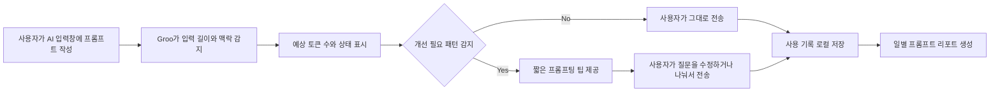

# Groo — 더 나은 질문, 더 가벼운 AI

## 0. 프로젝트 개요


https://grooforai.com/

**Groo**는 ChatGPT, Gemini, Claude 위에서 프롬프트 입력 길이와 맥락을 실시간으로 감지하고, 토큰 시각화·프롬프팅 팁·사용 리포트로 더 가볍고 명확한 AI 사용 습관을 돕는 크롬 확장 프로그램입니다.

> **더 나은 질문, 더 가벼운 AI** | Better Questions, Lighter AI

## 1. 현재 상태

| 구분               | 상태                             |
| ---------------- | ------------------------------ |
| Chrome Extension | Chrome Web Store 정식 등록         |
| Landing Page     | 공식 랜딩페이지 배포                    |
| 지원 플랫폼           | ChatGPT, Gemini, Claude        |
| 데이터 처리           | 입력 원문 외부 서버 전송 없이 브라우저 로컬에서 처리 |
| 저장소 구성           | 확장 프로그램, 랜딩페이지, 개인정보 처리방침 포함   |

## 2. 링크

* Chrome Web Store: https://chromewebstore.google.com/detail/groo/hgabaikdjeiplcaimladccjnbpijjaoo
* Landing Page: https://grooforai.com/
* GitHub Repository: https://github.com/yunxeo/TechforImpact_B-Side-Ground
* Privacy Policy: https://github.com/yunxeo/TechforImpact_B-Side-Ground/blob/main/Privacy%20Policy%20for%20Groo

## 3. 문제 정의

대화형 AI는 과제, 업무, 글쓰기, 리서치, 코딩 등 일상 작업에 빠르게 들어왔습니다. 그러나 사용자는 AI를 쓸 때 발생하는 서버 연산, 전력 소비, 탄소 배출, 하드웨어 자원 부담을 체감하기 어렵습니다.

B개발구역은 설문과 인터뷰를 통해 다음 문제를 확인했습니다.

* 많은 사용자가 AI 사용과 환경 부담 사이 관계를 구체적으로 알지 못함
* 환경 부담을 알아도 개인이 할 수 있는 행동을 떠올리기 어려움
* 업무나 학습 상황에서 AI 사용을 줄이라고 요구하는 방식은 현실성이 낮음
* 긴 텍스트를 그대로 붙여넣거나, 모호한 질문 때문에 같은 내용을 여러 번 다시 묻는 입력 습관이 반복됨

### 핵심 질문

> **어떻게 하면 일상적인 AI 사용 과정에서 환경을 위한 행동이 자연스럽게 일어나게 할 수 있을까?**

## 4. 최종 솔루션

Groo는 사용자가 기존 AI 서비스를 바꾸지 않고 쓸 수 있는 **브라우저 기반 프롬프팅 메이트**입니다.

사용자는 ChatGPT, Gemini, Claude에서 평소처럼 질문을 입력합니다. Groo는 입력창 근처에 작은 뱃지를 띄워 현재 입력 상태를 보여주고, 필요할 때 짧은 프롬프팅 팁을 제공합니다.

Groo는 AI 사용량을 강제로 줄이는 서비스가 아닙니다. 더 좋은 답변을 얻기 위한 효율적인 질문 습관이 더 가벼운 AI 사용 문화로 이어지도록 돕습니다.

### Groo가 해결하는 문제

| 구분   | 기존 문제                  | Groo의 접근                 |
| ---- | ---------------------- | ------------------------ |
| 인식   | 내가 얼마나 길게 입력하는지 알기 어려움 | 입력 길이와 예상 토큰 수를 실시간으로 표시 |
| 행동   | 모호한 질문으로 반복 대화 발생      | 상황별 프롬프팅 팁 제공            |
| 지속   | 한 번 보고 잊는 환경 메시지       | 일별 리포트로 습관 변화 확인         |
| 사용성  | 긴 작업 중 팁이 방해될 수 있음     | 집중 모드로 팁 노출 조절           |
| 진입장벽 | 환경 문제는 무겁고 추상적임        | 캐릭터 기반의 가벼운 넛지 제공        |

## 5. 주요 기능

### 1) 실시간 토큰 시각화


입력 중인 프롬프트 글자 수와 예상 토큰 수를 실시간으로 표시합니다.
입력 상태는 **낮음 / 중간 / 높음** 세 단계로 나뉩니다.

### 2) 인터랙티브 프롬프팅 가이드


Groo는 입력 문장 패턴을 브라우저 안에서 분석하고, 상황에 맞는 짧은 프롬프팅 팁을 제공합니다.

예시:

```text
목적을 함께 적으면 더 정확해요.
```

```text
출처 기준을 먼저 정하면 나중에 “근거 더 줘”라고 다시 묻는 일을 줄일 수 있어요.
```

```text
긴 내용은 조건과 본문을 나눠 쓰면 AI가 더 잘 이해해요.
```

### 3) 사용자 프롬프트 리포트


사용자는 하루 동안 AI를 어떻게 썼는지 리포트로 확인할 수 있습니다.

* 총 대화 수
* 평균 프롬프트 길이
* 플랫폼별 전송 횟수
* 낮음 / 중간 / 높음 비율
* 최고 사용 시간대
* 이전 사용 패턴 대비 변화

### 4) 집중 모드


보고서 분석, 코드 리뷰, 긴 문서 요약처럼 긴 입력이 필요한 상황에서는 집중 모드를 사용할 수 있습니다.

집중 모드는 프롬프팅 팁 노출을 줄여 사용자의 작업 흐름을 방해하지 않습니다.

### 5) 캐릭터 커스터마이징


Groo는 사용자의 AI 사용 습관을 함께 관리하는 캐릭터입니다.
기본 캐릭터를 쓰거나, 원하는 이미지를 업로드해 나만의 뱃지로 꾸밀 수 있습니다.

## 6. 사용자 흐름



## 7. 기술 스택

### Architecture

| 영역                 | 사용 기술 / 방식                   | 역할                         |
| ------------------ | ---------------------------- | -------------------------- |
| Extension Platform | Chrome Extension Manifest V3 | 브라우저 확장 프로그램 실행 기반         |
| Content Script     | DOM Monitoring               | AI 서비스 입력창 감지 및 Groo UI 삽입 |
| Token Estimation   | Local Token Estimation       | 입력 길이를 예상 토큰으로 변환하고 상태 분류  |
| Prompt Tip Engine  | Rule-based Regex / Heuristic | LLM API 없이 입력 유형 분석 및 팁 제공 |
| Local Analytics    | `chrome.storage.local`       | 사용 기록과 일별 리포트 로컬 저장        |
| Landing Page       | HTML / CSS / JavaScript      | 서비스 소개 및 설치 유도 페이지         |

### 개인정보 보호 방향

Groo는 사용자의 프롬프트 작성 과정에서 작동하므로 개인정보 보호를 핵심 설계 조건으로 두었습니다.

* 입력 원문을 외부 서버로 보내지 않는 로컬 분석 중심 구조
* LLM API 호출 없이 정규식과 휴리스틱으로 프롬프팅 팁 제공
* 사용 기록은 브라우저 `chrome.storage.local`에 저장
* Chrome Web Store 정책에 맞춰 개인정보 처리방침 공개

## 8. 프로젝트 구조

```text
TechforImpact_B-Side-Ground/
├── chrome-extension/
│   ├── assets/              # Groo 캐릭터, 아이콘, UI 에셋
│   ├── background/          # Extension background scripts
│   ├── content/             # 입력창 감지, 토큰 추정, 넛지 삽입 로직
│   ├── docs/                # 확장 프로그램 관련 문서
│   ├── popup/               # Extension popup UI
│   ├── manifest.json        # Chrome Extension Manifest V3 설정
│   └── README.md
│
├── landing/
│   └── index.html           # Groo 공식 랜딩 페이지
│
├── Privacy Policy for Groo  # 개인정보 처리방침
└── README.md
```

## 9. 설치 및 실행

### Chrome Web Store에서 설치

1. [Groo Chrome Web Store 페이지](https://chromewebstore.google.com/detail/groo/hgabaikdjeiplcaimladccjnbpijjaoo)에 접속합니다.
2. `Chrome에 추가`를 클릭합니다.
3. ChatGPT, Gemini, Claude에 접속합니다.
4. 입력창 근처에 Groo 뱃지가 표시되는지 확인합니다.

### 로컬에서 실행

```bash
git clone https://github.com/yunxeo/TechforImpact_B-Side-Ground.git
cd TechforImpact_B-Side-Ground
```

1. Chrome 주소창에서 `chrome://extensions`를 엽니다.
2. 우측 상단 `개발자 모드`를 켭니다.
3. `압축해제된 확장 프로그램을 로드합니다`를 클릭합니다.
4. `chrome-extension/` 폴더를 선택합니다.
5. ChatGPT, Gemini, Claude 중 하나에 접속해 작동을 확인합니다.

## 10. 기대 효과

### Practical Impact

* 프롬프트 작성 능력 향상
* 반복 질문 감소에 따른 시간 절약
* 더 명확한 질문을 통한 답변 품질 개선
* AI 사용 패턴 인식과 조절

### Environmental Impact

* 불필요하게 긴 입력과 반복 요청 감소
* 불필요한 연산과 자원 낭비에 대한 인식 형성
* 지속 가능한 디지털 행동 문화 확산

## 11. 협력 기관 및 참여 펠로우·멘토
협력 기관

서울환경연합, 카카오임팩트

참여 펠로우·멘토
Fellow: 이동이 님, 서울환경연합
Mentor: 이훈재 님, 카카오
Mentor: 최세현 님, 카카오

## 12. Team B개발구역

AI 시대에 지속 가능한 사용 문화를 고민하는 팀, B개발구역입니다.

**채준하** — Team Lead · UX/UI

**이윤서** — PM · Developer

**송지호** — Developer

**이재원** — Developer

**장윤진** — Research

## 13. Credits & License

### Credits

* **Project**: Groo
* **Team**: B개발구역
* **Program**: 카카오임팩트 × 연세대학교 Tech for Impact Campus
* **Character, Logo, UI Design, Graphic Assets**: B개발구역 제작
* **Typeface**: SUIT by SUNN
* **Development Note**: 일부 코드는 AI assistance를 받아 작성했으며, B개발구역 팀이 검토·수정·통합했습니다.

### Font License

본 프로젝트는 SUIT 폰트를 사용합니다.
SUIT는 SIL Open Font License 1.1에 따라 사용할 수 있습니다.

* SUIT: https://sun.fo/suit/
* SUIT License: https://github.com/sun-typeface/SUIT/blob/main/LICENSE

### Repository License

© 2026 B개발구역. All rights reserved.

본 저장소는 카카오임팩트 × 연세대학교 Tech for Impact Campus 프로젝트 제출과 학습 참고를 위해 공개했습니다.

별도 `LICENSE` 파일에서 다르게 명시하지 않는 한, 본 저장소의 코드, 문서, 캐릭터, 로고, UI 디자인, 그래픽 에셋에 대한 복제, 수정, 배포, 재배포, 상업적 사용을 허용하지 않습니다.

GitHub 공개 저장소의 열람과 포크 기능은 GitHub 이용 약관이 허용하는 범위에 따릅니다. 그 외 사용에는 B개발구역의 사전 허가가 필요합니다.

### Asset Notice

Groo 캐릭터, 로고, 서비스명, UI 디자인, 아이콘, 일러스트레이션, README 이미지 자료는 B개발구역이 제작한 프로젝트 에셋입니다.
해당 에셋은 오픈소스 라이선스 적용 대상이 아니며, 무단 사용·수정·재배포를 금지합니다.
